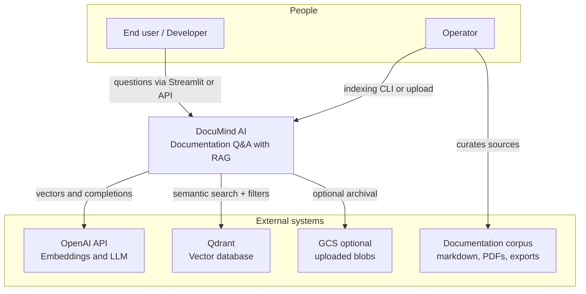
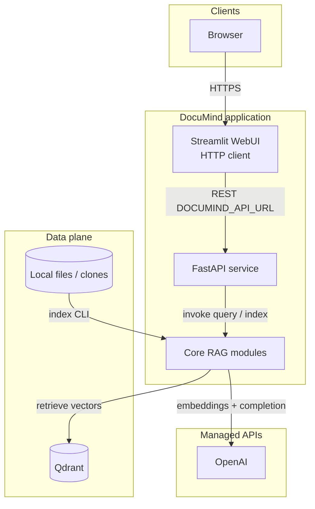
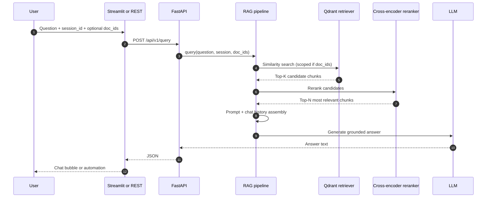
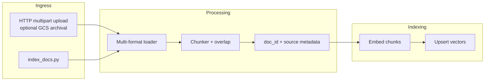
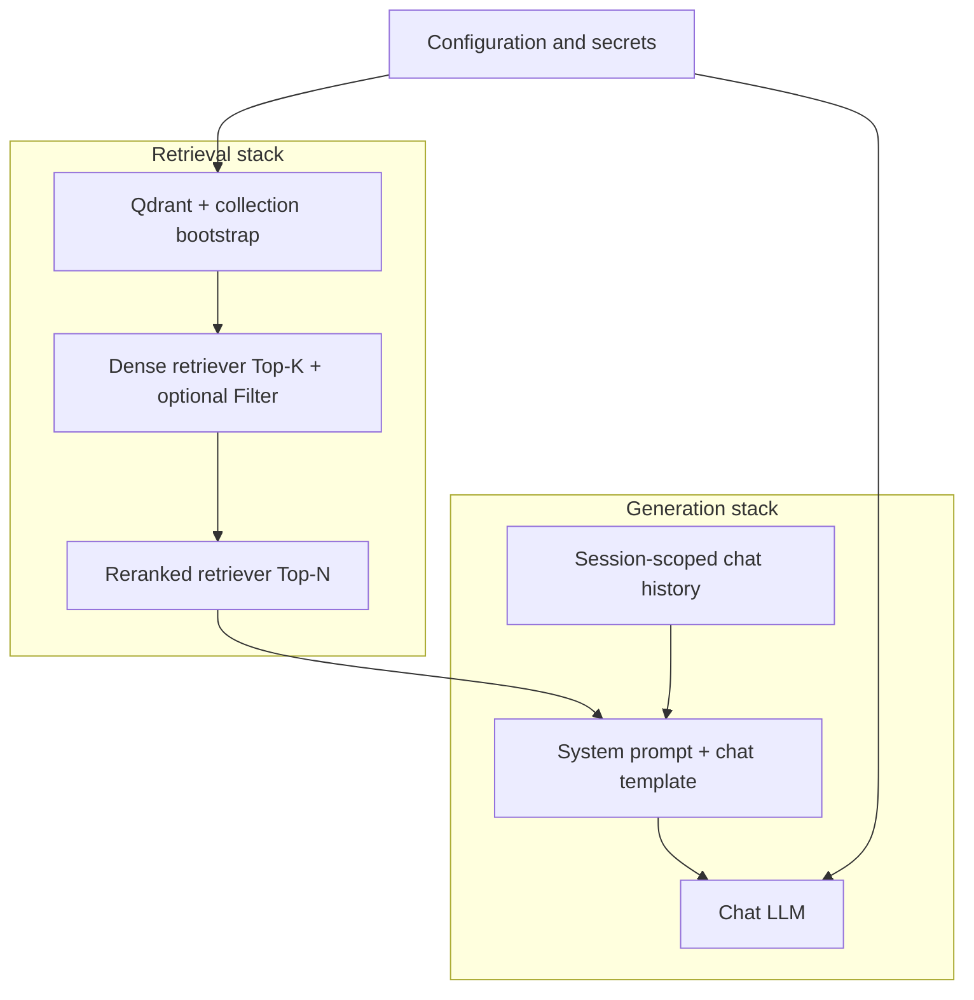
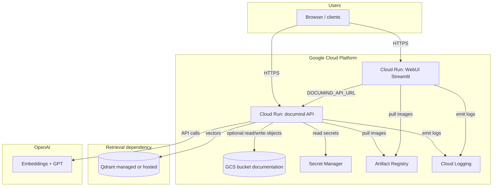
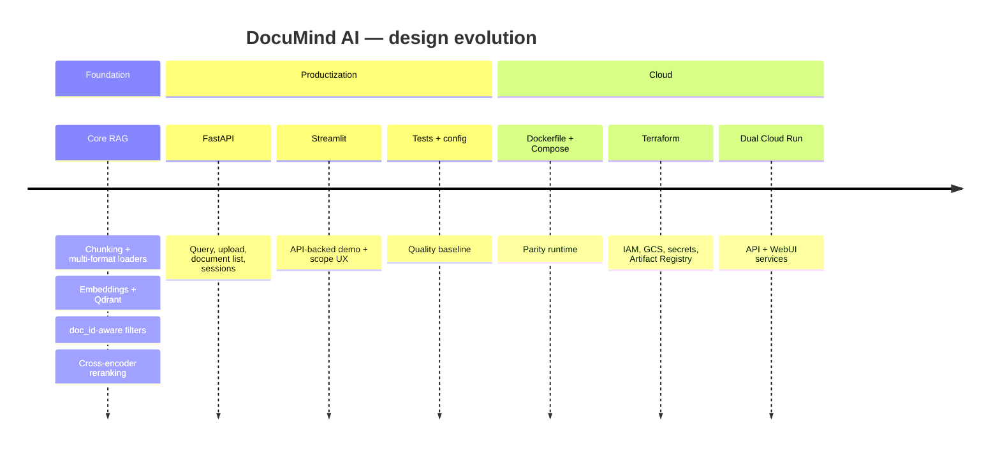

# DocuMind AI — System Design Evolution

This note is written so you can **walk recruiters and hiring managers** through how DocuMind AI works: what problem it solves, how the architecture evolved from a prototype to something production-minded, and why each major piece matters. Technical depth grows section by section; you can stop after any level depending on your audience.

---

## 1. What DocuMind AI is (elevator pitch)

**DocuMind AI** helps people get accurate answers from **technical documentation** instead of searching long pages by hand. Under the hood it uses **Retrieval-Augmented Generation (RAG)**: the system first **finds** the most relevant passages from your docs, then **generates** an answer that is **grounded** in those passages. Users can **scope** questions to **one or more uploaded documents** (metadata **`doc_id`** filters in Qdrant) so answers stay on-topic for a specific manual or run.

**Why recruiters care:** it shows end-to-end thinking—**data** (multi-format documents), **ML/retrieval** (vectors, reranking, filtering), **software** (REST API + demo UI), and **cloud** (containerized stack, GCP with Terraform)—not just a notebook demo.

---

## 2. How the design evolved (three stages)

| Stage | Focus | What changed |
|--------|--------|----------------|
| **Stage A — Core RAG** | Prove value on a laptop | Documents → chunks → embeddings → vector DB → retrieve → rerank → answer |
| **Stage B — Product surface** | Make it usable and integratable | **FastAPI** contract (query, upload, document catalog, session control); **Streamlit as API client**; typed config and tests |
| **Stage C — Cloud-ready** | Operate like a real service | **Dockerfile** + **docker-compose** (Qdrant + API + WebUI); **Terraform** on GCP: Artifact Registry, GCS, Secret Manager, **two Cloud Run services** (API + WebUI) |

The diagrams below mirror this evolution from **concept** → **runtime architecture** → **detailed flows** → **GCP target**.

---

## 3. Stage A — System context (who talks to whom)

This is the **highest-level** picture: actors, DocuMind, and external services you depend on.

### How to explain this diagram

| Element | Role | Why it matters |
|--------|------|----------------|
| **End user** | Consumes answers through **UI or API** | Clear product surfaces—not only notebooks. |
| **Operator / you** | Feeds docs (CLI upload, HTTP upload), monitors infra | Awareness of **MLOps**: ingestion repeats as docs change. |
| **DocuMind AI** | System boundary | Orchestration and retrieval quality belong here; model APIs are delegated. |
| **OpenAI** | Embeddings + chat model | Semantic search plus fluent, instruction-following answers. |
| **Qdrant** | Vector index + payload filters | Enables **narrow retrieval** (`doc_id`) for per-document assistants. |
| **GCS (optional)** | Durable uploads | When **`GCS_BUCKET_DOCS`** is set, uploads are archived under a timestamp path; indexing still happens server-side into Qdrant. |
| **Corpus** | Trust boundary | RAG quality is capped by **what you index** and how it is chunked. |

---

## 4. Stage B — Containers (what actually runs)

**Local parity** deployment: logical services and how they connect.

### How to explain this diagram

| Component | Role | Why it matters |
|-----------|------|----------------|
| **Streamlit UI** | **Demo UX** backed by **`httpx`** | Same semantics as external integrators calling OpenAPI—you avoid “works in UI only” divergence. |
| **FastAPI** | **Stable contract**: query, uploads, **`GET /documents`**, **`clear-session`** | Enables bots, portals, automation without Streamlit. |
| **Core RAG module** | Retrieval + prompting + **`doc_id`** metadata | Single implementation used by CLI indexing and HTTP paths. |
| **Qdrant** | Vector index | Search layer can scale/evolve independently of the LLM. |
| **File / corpus sources** | Raw documentation | Operators can seed the index offline or complement UI uploads. |
| **OpenAI** | Provider | Keeps frontier language behavior while DocuMind focuses on **grounding**. |

---

## 5. Query path — sequence (what happens on one question)

Use this when someone asks: *“Walk me through a single request.”*

### How to explain this diagram

| Step | What happens | Why it matters |
|------|----------------|----------------|
| 1 | User submits via Streamlit chat or **`curl`** | **One** pipeline for demos and integrations. |
| 2–3 | **Dense retrieval** in Qdrant, optionally **`metadata.doc_id` filter** | Precision for “Ask this PDF only” workflows. |
| 4–5 | **Cross-encoder reranking** | Reorders passages by **query–passage fit**—common production pattern between ANN recall and LLM context limits. |
| 6 | **Prompt assembly** + **session memory** | Grounding instructions + follow-up questions anchored in the same **`session_id`**. |
| 7–8 | **Generation** | Natural-language output with citations requested in-system; honesty when context is thin. |

**Recruiter-friendly line:** *“We retrieve first, rerank second, then make the model read only the top passages—including the ability to isolate a single document—before it answers.”*

---

## 6. Upload and indexing path — how scoped knowledge enters the system

### How to explain this diagram

| Component | Role | Why it matters |
|-----------|------|----------------|
| **Upload / CLI** | Two on-ramps: **operators** scripting vs **end users** self-serving uploads | Mirrors real doc portals and batch reindex jobs. |
| **Loader** | PDF, Markdown, HTML, DOCX, CSV, JSON, plain text | Enterprise docs rarely arrive as a single Markdown tree. |
| **Chunk overlap** | Stabilizes answers across splits | Boundary effects are a practical RAG failure mode. |
| **`doc_id`** | Logical document key for filters | Enables **scoped Q&A** and catalog APIs (**`GET /api/v1/documents`**). |
| **Upsert / embed** | Qdrant + OpenAI embeddings | Turning static files into searchable vectors. |

---

## 7. Internal RAG composition (building blocks inside the “brain”)

### How to explain this diagram

| Piece | Role | Why it matters |
|-------|------|----------------|
| **Configuration** | Models, URLs, bucket names | **Secrets** stay out of code; parity across environments. |
| **Dense stage** | Recall + structured filters | **Wide net** plus **narrow scope** via payload indexes. |
| **Reranker** | Precision | Bridges cheap ANN scores and what actually helps the prompt. |
| **Prompt template** | Citations + Markdown + grounding | Operationalizes responsible answers in UI and API alike. |
| **Session memory** | Per-session history | Enables short multi-turn dialogs; clearing prevents cross-doc bleed. |

---

## 8. Stage C — Target GCP architecture (Terraform + dual Cloud Run + GCS)

How DocuMind looks as managed services aligned with a **GCP-heavy** posture (e.g. Datatonic-style delivery).

### How to explain this diagram

| Component | Role | Why it matters |
|-----------|------|----------------|
| **Cloud Run (×2)** | **Stateless API** + **demo UI**, scale-to-zero or min instances per service | Mirrors **`docker-compose`** split (`api` + `webui`); **`terraform/outputs.tf`** surfaces both URLs. |
| **Artifact Registry** | Immutable images | Reproducible releases; Terraform references image URIs. |
| **GCS** | Upload archive + corpus staging | Separation of blobs and compute; fits compliance-style retention narratives. |
| **Secret Manager** | OpenAI and Qdrant credentials | Prefer over baking keys into Compose (local dev still often uses `.env`). |
| **Cloud Logging** | Centralized telemetry | Operational stories: latency tails, ingestion failures, bad uploads. |
| **Qdrant** | Specialized vector workload | Stateful index lives beside serverless inference—typical separation in RAG architectures. |

**Optional sound bite:** *“The API and UI each autoscale independently; blobs land in GCS; vectors stay where nearest-neighbor search is efficient.”*

---

## 9. Evolution timeline (how you tell the story in order)

Use this as a **30-second arc**: *foundation → product → cloud*.

---

## 10. Interview talking points (tie design to business outcomes)

1. **Grounding** — Retrieval constrains factual claims; prompting asks for citations and explicit gaps.  
2. **Quality vs cost** — Two-stage retrieval (ANN + rerank) trades a bit of latency for sharper context vs stuffing the prompt.  
3. **Document isolation** — **`doc_id` filters support** regulated or customer-specific corpuses without rebuilding separate collections per file (though collection-level isolation remains an option).  
4. **Separation of concerns** — UI is not authoritative for business logic; API is the spine for humans and integrations.  
5. **Operability** — Logs, IaC dual services, secrets, GCS—not only model tuning.  
6. **Extensibility** — Sparse **BM25**/hybrid fusion, hosted rerank APIs (e.g. Cohere), or Vertex batch indexing plug in **without rewriting** the Stage B story.

---

## 11. Document map (where this lives in the repo)

| Artifact | Purpose |
|----------|---------|
| **`README.md`** | Quick start and commands |
| **`CLAUDE.md`** | Deep blueprint and interview checklist |
| **`docs/codebase_explain.md`** | File-by-file map for engineers |
| **`docs/DocumindAI_System_Design.md`** | This doc — **recruiter-oriented design evolution** |

---

*You can present sections 1–4 in five minutes, add sections 5–7 for retrieval depth (especially **`doc_id` scoping**), and close with section 8 for GCP operations and Datatonic alignment.*
