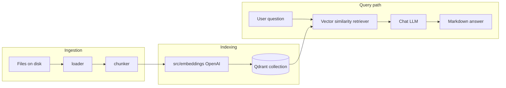
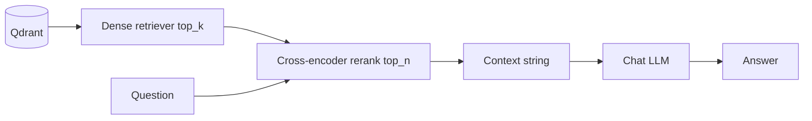
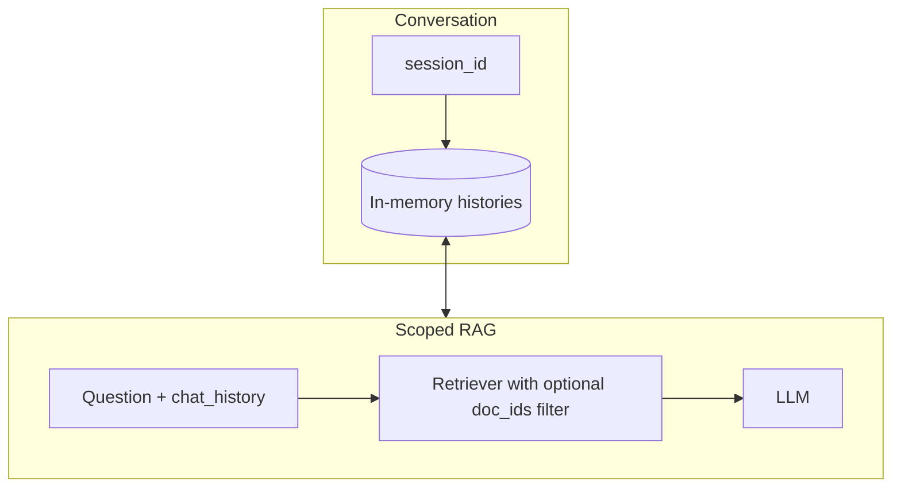
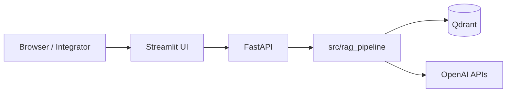
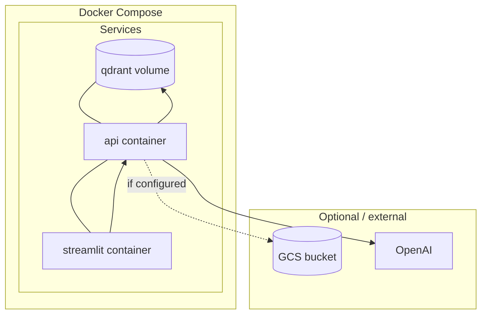
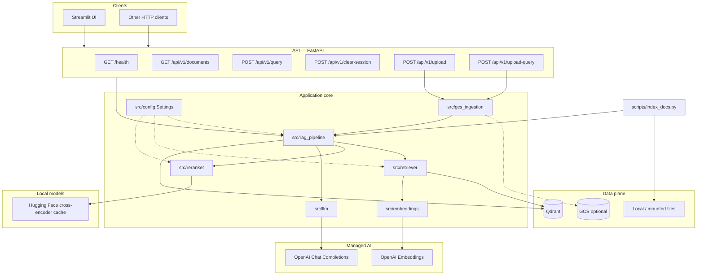
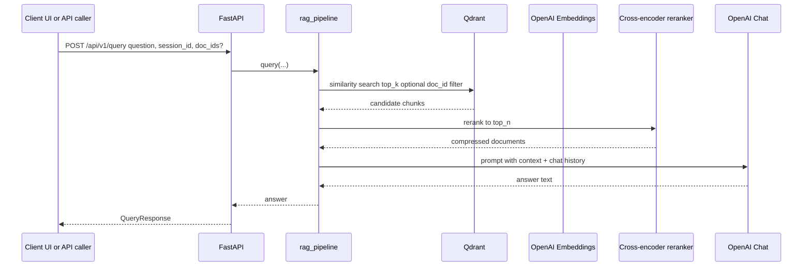
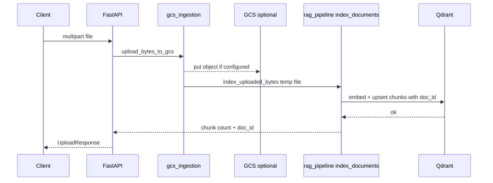

# DocuMind AI — Evolving Architecture

This document describes how **DocuMind AI** was grown from a minimal RAG sketch into a **multi-service documentation Q&A platform**: modular Python packages, a retrieval stack on **Qdrant**, an **OpenAI**-backed generation path, a **FastAPI** surface, a **Streamlit** client, and **Docker Compose** for local “full stack” runs. Diagrams summarize **what existed after each phase** and **what functionality was added**.

**Scope note:** Retrieval in the current codebase is **dense vector search** on Qdrant (cosine), optionally filtered by `doc_id`, followed by **cross-encoder reranking** (Hugging Face). A lexical layer (for example BM25) is a natural extension aligned with broader product docs but is **not wired in `src/retriever.py` today**.

---

## Phase 1 — Core RAG backbone (documents → vectors → answers)

**Goal:** Prove the ingestion and answer loop end-to-end with clear module boundaries instead of one opaque script.

**What was developed**

| Area | Implementation |
|------|------------------|
| Ingestion | `pipelines/components/loader.py` — multi-format load (Markdown, TXT, PDF, HTML, DOCX, CSV, JSON) |
| Chunking | `pipelines/components/chunker.py` — token-oriented splits aligned with `Settings.chunk_size` / `chunk_overlap` |
| Embeddings | `src/embeddings.py` — OpenAI `text-embedding-3-small` (dimension from config) |
| Vector store | `src/retriever.py` — Qdrant client, collection bootstrap, LangChain `QdrantVectorStore` |
| Generation | `src/llm.py` + LangChain prompts in `src/rag_pipeline.py` — GPT-4o-style completion with citation-oriented system prompt |
| Orchestration | `src/rag_pipeline.py` — `index_documents`, `build_rag_chain`, `query` entry points |
| Scratch / sanity | `documentation-qa.py` — thin legacy entry that delegates to `src.rag_pipeline.query` |

**Functionality unlocked**

- Index local paths via CLI wiring (`scripts/index_docs.py` → `index_documents`).
- Ask questions against retrieved context using a LangChain runnable chain (parallel context + question → prompt → LLM).

---

## Phase 2 — Retrieval quality (dense top‑k + cross‑encoder rerank)

**Goal:** Reduce “almost right” chunks by rescoring candidates after vector search.

**What was developed**

| Area | Implementation |
|------|------------------|
| Candidate pool | Configurable `top_k` similarity hits from Qdrant |
| Reranking | `src/reranker.py` — `ContextualCompressionRetriever` + `CrossEncoderReranker` + cached `HuggingFaceCrossEncoder` (default `cross-encoder/ms-marco-MiniLM-L-6-v2`; override via `CROSS_ENCODER_MODEL`) |
| Chain wiring | `build_rag_chain` uses `get_reranked_retriever` instead of a raw retriever only |

**Functionality unlocked**

- Narrower, more precise context windows passed to the LLM (`rerank_top_n`).
- Same user-facing API; improved grounding quality under the hood.

---

## Phase 3 — Conversational memory and document isolation

**Goal:** Support multi-turn chat and optionally restrict retrieval to one or more uploaded or indexed documents.

**What was developed**

| Area | Implementation |
|------|------------------|
| Sessions | `InMemoryChatMessageHistory` keyed by `session_id` (`get_session_history` / `_store`) |
| LangChain integration | `RunnableWithMessageHistory` around the RAG chain (`src/rag_pipeline.py`) |
| Metadata for filtering | Every chunk stamped with `doc_id` (and `source`) during `index_documents` |
| Filtered retrieval | `get_base_retriever(..., doc_ids=...)` → Qdrant payload filter on `metadata.doc_id` |
| Session reset | `clear_session_history` exposed for scope changes |

**Functionality unlocked**

- Follow-up questions reuse prior turns inside the same `session_id`.
- “Ask about this doc only” by passing `doc_ids` into the chain.

---

## Phase 4 — Product surface (FastAPI + Streamlit)

**Goal:** Expose the pipeline over HTTP and add a usable UI for uploads, scoped Q&A, and health checks.

**What was developed**

| Area | Implementation |
|------|------------------|
| HTTP API | `api/main.py`, `api/routes.py`, `api/models.py` |
| Operations | `GET /health`, `GET /api/v1/documents` (aggregate from Qdrant), `POST /api/v1/query`, `POST /api/v1/clear-session`, `POST /api/v1/upload`, `POST /api/v1/upload-query` |
| UI | `ui/streamlit_app.py` — httpx client to API, sidebar upload + document scope, chat transcript |

**Functionality unlocked**

- Any client can integrate via OpenAPI (`/docs`).
- Non-developers can demo through Streamlit (`DOCUMIND_API_URL` configurable).
- Live listing of indexed documents and chunk counts for transparency.

---

## Phase 5 — Platform packaging and cloud-ready ingestion hooks

**Goal:** Repeatable environments, persistence, optional object storage on upload.

**What was developed**

| Area | Implementation |
|------|------------------|
| Containers | `Dockerfile` (API default command), shared image for Streamlit override |
| Compose | `docker-compose.yml` — **Qdrant** (persisted volume), **api**, **webui** (internal URLs: `DOCUMIND_API_URL=http://api:8000`, `QDRANT_URL=http://qdrant:6333`), Hugging Face cache volume |
| GCS bridge | `src/gcs_ingestion.py` — `upload_bytes_to_gcs` (when `GCS_BUCKET_DOCS` + credentials exist) + `index_uploaded_bytes` temp-file path into `index_documents` |
| Scripts | `scripts/index_docs.py`, `scripts/download_gcp_docs.py`, deployment helpers referenced from README |
| Tests | `tests/test_api.py`, `tests/test_rag_pipeline.py`, `tests/test_retrieval.py` |
| Pipeline placeholder | `pipelines/indexing_pipeline.py` — reserved for Vertex AI / batch orchestration |

**Functionality unlocked**

- One-command local stack: vector DB + API + UI.
- Upload path can mirror bytes to **GCS** while still indexing locally; graceful degradation if GCP is unset.
- CI-friendly verification of API and retrieval behavior.

---

## Current system — full architecture and responsibilities

---

## End-to-end workflows

### Workflow A — Query existing index (`POST /api/v1/query`)

Typical path used by Streamlit **“Ask existing index”** when the user scopes to all documents or selected `doc_ids`.

### Workflow B — Upload, optional GCS mirror, index (`POST /api/v1/upload`)

### Workflow C — Upload and ask in one step (`POST /api/v1/upload-query`)

Combines Workflow B with a scoped `query(..., doc_ids=[new_id])` so the first answer is grounded only on the freshly indexed upload.

---

## Configuration touchpoints

| Concern | Where |
|--------|--------|
| Models, chunking, top_k, rerank depth | `src/config.py` / environment variables |
| Qdrant URL and collection | `QDRANT_URL`, `COLLECTION_NAME` |
| OpenAI keys and model names | `OPENAI_API_KEY`, `embedding_model`, `llm_model` |
| GCS | `GCP_PROJECT_ID`, `GCS_BUCKET_DOCS`, Google credentials |
| UI → API routing | `DOCUMIND_API_URL` (Streamlit) |

---

## Evolution summary

| Phase | Focus | New capabilities |
|-------|--------|------------------|
| 1 | Core RAG | Load → chunk → embed → Qdrant → answer |
| 2 | Retrieval | Cross-encoder rerank on dense candidates |
| 3 | UX depth | Multi-turn memory, per-document retrieval scope |
| 4 | Delivery | FastAPI contract, Streamlit demo client |
| 5 | Operations | Docker Compose stack, optional GCS, tests, automation hooks |

This phased view matches the **actual layout** of the repository (`src/`, `api/`, `ui/`, `pipelines/`, `scripts/`, `docker-compose.yml`) and is the reference for interviews and future GCP pipeline work (`pipelines/indexing_pipeline.py`).
