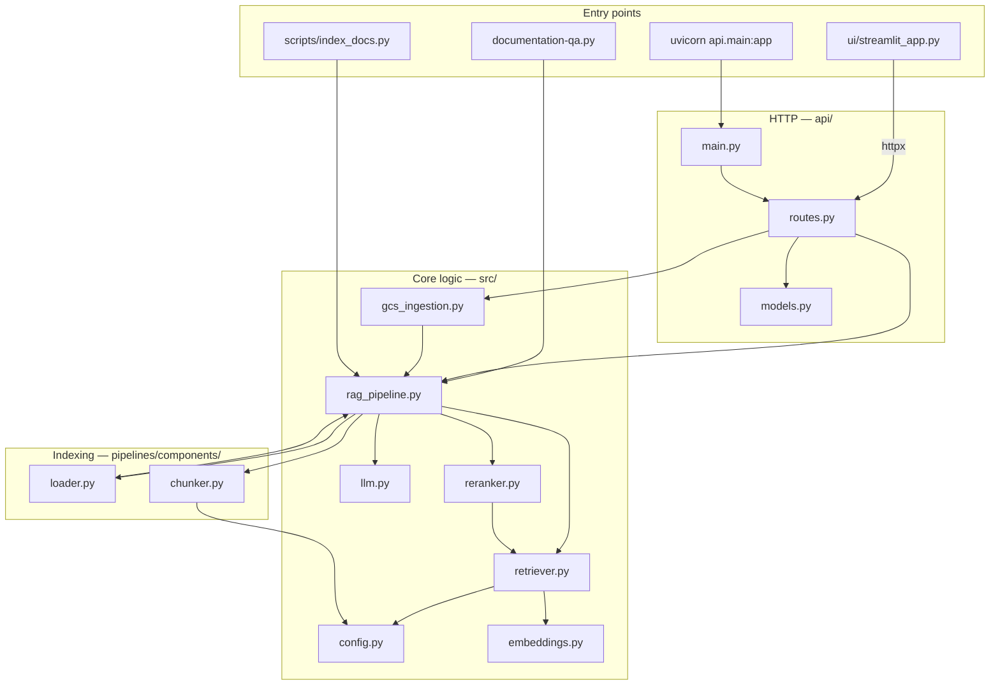
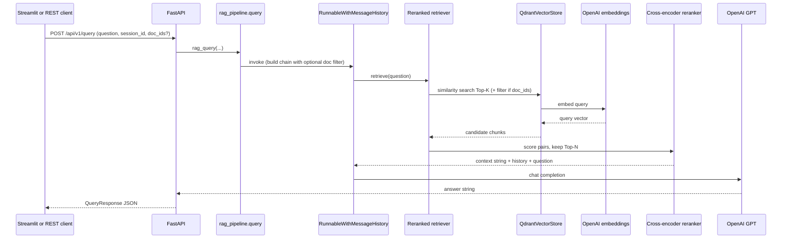
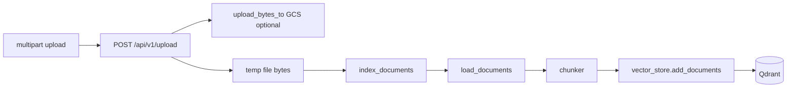
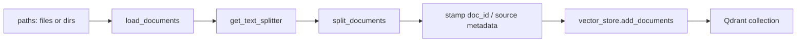

# DocuMind AI — Codebase explanation (interview study guide)

Use this file to **map the repository in your head**: what each folder does, how data flows, and which file to mention when an interviewer asks “where is X implemented?”

---

## 1. One-sentence summary

**DocuMind AI** is a **RAG application**: it **indexes** documentation into **Qdrant** (OpenAI embeddings), then on each **question** it **retrieves** relevant chunks (optionally **filtered by `doc_id`**), **reranks** them with a **Hugging Face cross-encoder**, and **generates** an answer with **OpenAI** via LangChain. **FastAPI** exposes query, upload, and document-list endpoints; **Streamlit** is a **thin HTTP client** to that API (default `DOCUMIND_API_URL`, often `http://127.0.0.1:8001` in local scripts or `http://api:8000` in Docker Compose).

---

## 2. Repository map (mental diagram)

**How to say it in an interview:** *“Entry points stay thin: the API owns HTTP and calls `rag_pipeline` and `gcs_ingestion`. Streamlit does not import the RAG chain directly—it calls the REST API so there is one behavior path in production.”*

---

## 3. Directory-by-directory tour

| Path | Purpose |
|------|---------|
| **`src/`** | Settings, Qdrant retriever + optional `doc_id` filters, cross-encoder reranking, RAG chain, session history, indexing, Qdrant document listing. **`gcs_ingestion.py`** uploads bytes to GCS when configured and delegates indexing to **`index_documents`**. |
| **`api/`** | FastAPI: health, query, indexed-documents list, session clear, file upload + upload-and-query. |
| **`pipelines/`** | Ingestion building blocks (**`load_documents`**, **`get_text_splitter`**) and a **placeholder** for future Vertex batch orchestration (**`pipelines/indexing_pipeline.py`**). |
| **`ui/`** | Streamlit: upload, scope selection (all vs selected docs), chat via **`POST /api/v1/query`**. |
| **`scripts/`** | CLIs and helpers: **`index_docs.py`**, **`download_gcp_docs.py`**, doc generators (**`build_gcp_deployment_docx.py`**, **`generate_deployment_guide.py`**, **`build_interview_qa_docx.py`**). |
| **`tests/`** | Pytest smoke tests (health, loaders/chunkers where present); heavier RAG tests may remain skipped without keys + Qdrant. |
| **`terraform/`** | GCP: APIs, IAM, Secret Manager stubs, GCS bucket, Artifact Registry, **two** Cloud Run services (API + WebUI), outputs. |
| **Root** | **`Dockerfile`**, **`docker-compose.yml`** (Qdrant + API + WebUI), **`requirements.txt`**, **`pyproject.toml`**, **`.env.example`**, design docs. |

---

## 4. `src/` — the heart of the system

### 4.1 `config.py` — single source of configuration

- **`Settings`** (`pydantic_settings.BaseSettings`) loads **environment variables** and optional **`.env`** (path resolved next to project root).
- **`get_settings()`** is **`lru_cache`d** so env is not re-parsed on every call.
- Notable fields: **`OPENAI_API_KEY`**, **`QDRANT_URL`**, **`QDRANT_API_KEY`**, **`COLLECTION_NAME`**, **`embedding_model`** / **`embedding_dimensions`** (default 1536 for `text-embedding-3-small`), chunk sizes, **`top_k`**, **`rerank_top_n`**, **`CROSS_ENCODER_MODEL`**, **`GCS_BUCKET_DOCS`**, **`GCP_PROJECT_ID`**, **`memory_window_k`** (reserved in config; not wired into the chain in the current module—candidates for a sliding history window).

**Interview line:** *“Config is typed and env-driven so the same code runs locally, in Docker, and on Cloud Run with different secrets.”*

---

### 4.2 `embeddings.py` and `llm.py` — thin factories

Both wrap LangChain OpenAI integrations with values from **`Settings`**.

---

### 4.3 `retriever.py` — Qdrant + dense retrieval + collection bootstrap

- Builds **`QdrantClient`** from URL and optional API key.
- **`_ensure_collection`**: creates the collection with **cosine** distance and vector size from **`embedding_dimensions`**; attempts a **payload index** on **`metadata.doc_id`** for filtered search.
- **`get_vector_store`** → **`QdrantVectorStore`** with shared embeddings.
- **`get_base_retriever`**: **`similarity`** search with **`k = top_k`**; if **`doc_ids`** is non-empty, applies a Qdrant **`Filter`** with **`MatchAny`** on **`metadata.doc_id`**.

**Interview line:** *“First stage is dense vector search; optional metadata filters let us answer over one uploaded manual without polluting context with the rest of the corpus.”*

---

### 4.4 `reranker.py` — second-stage precision

- **`ContextualCompressionRetriever`** + **`CrossEncoderReranker`** (Hugging Face **`HuggingFaceCrossEncoder`**).
- **`_get_cross_encoder`** uses a module-level **`_model_cache`** so large cross-encoder weights are **not re-downloaded/re-instantiated** per retriever construction.
- Forwards **`doc_ids`** into **`get_base_retriever`** when supplied.

---

### 4.5 `rag_pipeline.py` — orchestration, memory, indexing, catalog

**A) `format_docs`** — joins retrieved **`Document`** page content for the prompt.

**B) `build_rag_chain`** — LangChain composition:

1. **`RunnableParallel`**: **`context`** = question → reranked retriever → **`format_docs`**; **`question`** and **`chat_history`** passthrough.
2. **`ChatPromptTemplate`**: system message (documentation assistant + citations + Markdown), **`MessagesPlaceholder("chat_history")`**, human **`{question}`**.
3. LLM → **`StrOutputParser`**.

Optional **`doc_ids`** narrow the underlying retriever to those documents only.

**C) Session memory** — **`_store`** maps **`session_id`** → **`InMemoryChatMessageHistory`**. **`RunnableWithMessageHistory`** supplies **`chat_history`**.

**D) `clear_session_history(session_id)`** — drops history for that session (API and UI call this when scope changes).

**E) `index_documents(paths, ..., doc_id=None, source_name=None)`** → **`(chunk_count, doc_id)`**  
Loads via **`pipelines.components.loader.load_documents`**, splits with **`get_text_splitter`**, stamps **`metadata["doc_id"]`** and optional **`metadata["source"]`** (human-readable filename), **`add_documents`** into Qdrant.

**F) `get_indexed_documents`** — scrolls Qdrant and aggregates **`{doc_id, filename, chunk_count}`** per logical document (returns **`[]`** if collection missing).

**G) `query(question, session_id="default", doc_ids=None)`** — builds a fresh chain per call (with history wrapper), invokes with configurable **`session_id`**.

---

### 4.6 `gcs_ingestion.py` — uploads and one-shot indexing

- **`upload_bytes_to_gcs`**: if **`GCS_BUCKET_DOCS`** is set and credentials work, writes under **`raw/uploads/{timestamp}-{filename}`**; otherwise logs and returns **`None`**.
- **`index_uploaded_bytes`**: writes bytes to a temp file, calls **`index_documents`** with **`source_name=filename`**, returns **`(chunks, doc_id)`**.

Used by **`POST /api/v1/upload`** and **`POST /api/v1/upload-query`**.

---

## 5. `pipelines/components/` — ingestion building blocks

### 5.1 `loader.py`

- **`load_documents`**: walks files or **`rglob`** directories; **`SUPPORTED_EXTS`** includes **`.pdf`**, **`.md`/`.txt`**, **`.html`/`.htm`**, **`.docx`**, **`.csv`**, **`.json`** via LangChain community loaders (with CSV/JSON fallbacks where needed).

### 5.2 `chunker.py`

- **`RecursiveCharacterTextSplitter`** from settings: **`chunk_size`**, **`chunk_overlap`**, separator priority for technical docs.

### 5.3 `embedder.py`

- Re-exports **`get_embeddings()`** for pipeline symmetry.

### 5.4 `pipelines/indexing_pipeline.py`

- **`index_source_placeholder`** raises **`NotImplementedError`** — placeholder for **Vertex AI Pipelines** / scheduled jobs; day-to-day indexing uses **`scripts/index_docs.py`** or the upload API.

---

## 6. `api/` — HTTP surface

- **`main.py`** — FastAPI app, includes **`router`**.
- **`models.py`** — **`QueryRequest`** (`question`, `session_id`, optional **`doc_ids`**), **`QueryResponse`**, **`DocumentInfo`**, **`UploadResponse`**, **`UploadQueryResponse`**, **`HealthResponse`** (`service: documind-api`).
- **`routes.py`** (high level):
  - **`GET /health`**
  - **`GET /api/v1/documents`** — **`get_indexed_documents()`**
  - **`POST /api/v1/query`** — **`rag_query(..., doc_ids=...)`**
  - **`POST /api/v1/clear-session?session_id=...`**
  - **`POST /api/v1/upload`** — multipart file → optional GCS + **`index_uploaded_bytes`**
  - **`POST /api/v1/upload-query`** — upload, index, then query scoped to **`doc_ids=[doc_id]`**

Handlers **import** **`src`** inside the route to keep optional import cost localized (pattern preserved from earlier revisions).

---

## 7. `ui/streamlit_app.py`

- Uses **`httpx`** against **`DOCUMIND_API_URL`** (default **`http://127.0.0.1:8001`**).
- Sidebar: API health check, **file upload** (`/api/v1/upload`), refreshable **document scope** (**all** vs **checkbox-selected** docs), **clear conversation** (new session id + server **`clear-session`**).
- Chat: **`POST /api/v1/query`** JSON body includes **`doc_ids`** when scoped.
- Does **not** call **`rag_pipeline.query`** in-process—aligns Compose setup where WebUI reaches API at **`http://api:8000`**.

---

## 8. `scripts/` (common)

| Script | Role |
|--------|------|
| **`index_docs.py`** | CLI: paths + optional **`--collection`**; calls **`index_documents`** (**returns `(chunks, doc_id)`** tuple). |
| **`download_gcp_docs.py`** | Shallow **`git clone`** of **`GoogleCloudPlatform/python-docs-samples`** into **`data/raw/`**. |
| **`build_gcp_deployment_docx.py`**, **`generate_deployment_guide.py`**, **`build_interview_qa_docx.py`** | Documentation / deployment artifacts generators. |

**`documentation-qa.py`** (repo root): legacy minimal script importing **`query`**—comment points to **`src/`**, **`api/`**, **`scripts/`**.

---

## 9. Tests

- **`test_api.py`** — **`GET /health`** smoke test.
- **`test_retrieval.py`** — loaders / splitter behavior where implemented.
- **`test_rag_pipeline.py`** — integration tests may remain **skipped** without live Qdrant + keys + data.

---

## 10. End-to-end flows (diagrams)

### 10.1 Query flow (online, via API)

### 10.2 Upload + index flow

### 10.3 Indexing flow (offline / CLI)

---

## 11. Deployment-related files

- **`Dockerfile`** — Python 3.11 slim; installs **`git`**; **`torch` CPU wheels** via PyTorch index to avoid CUDA bloat; then **`requirements.txt`**; copies **`src`**, **`api`**, **`pipelines`**, **`scripts`**, **`ui`**; **`PYTHONPATH=/app`**; default **`CMD`** runs **`uvicorn api.main:app`** on port **8000**.
- **`docker-compose.yml`** — three services:
  - **Qdrant**: host **`6335` → container `6333` (avoids clashes with another local Qdrant).
  - **API**: build image, **`8001:8000`**, **`QDRANT_URL=http://qdrant:6333`**, optional **`COLLECTION_NAME`**, **`data/`** mount, **`hf_cache`** volume for reranker model.
  - **WebUI**: same image with **`streamlit run ui/streamlit_app.py`**; **`DOCUMIND_API_URL=http://api:8000`**.
- **`terraform/`** — not a stub: split modules (**`apis.tf`**, **`iam.tf`**, **`secrets.tf`**, **`gcs.tf`**, **`artifact_registry.tf`**, **`cloud_run_api.tf`**, **`cloud_run_webui.tf`**, **`outputs.tf`**). Outputs expose **`api_url`**, **`webui_url`**, bucket name, Artifact Registry prefix, Secret Manager IDs. **`main.tf`** documents remote-state prerequisites (**`versions.tf`**).

The API container alone does **not** bundle Qdrant; production still needs managed Qdrant, Qdrant Cloud, or a separate compose/service.

---

## 12. “Where do I change X?” cheat sheet

| Want to change… | Primary file(s) |
|-----------------|-------------------|
| Env var names / defaults | **`src/config.py`**, **`.env.example`** |
| Embedding or LLM model | **`src/config.py`** + **`embeddings.py`**, **`llm.py`** |
| Chunk size / overlap | **`src/config.py`**, **`pipelines/components/chunker.py`** |
| Retrieval K / rerank N | **`src/config.py`** |
| Cross-encoder model | **`CROSS_ENCODER_MODEL`** / **`config.py`**, **`reranker.py`** cache |
| System prompt | **`src/rag_pipeline.py`** (`ChatPromptTemplate`) |
| Qdrant collection / URL / **`doc_id` filter schema | **`src/config.py`**, **`src/retriever.py`** |
| HTTP contracts / uploads | **`api/routes.py`**, **`api/models.py`** |
| GCS upload path / bucket | **`src/gcs_ingestion.py`**, **`GCS_BUCKET_DOCS`**, Terraform **`gcs.tf`** |
| Streamlit API URL / UX | **`ui/streamlit_app.py`**, env **`DOCUMIND_API_URL`** |
| GCP services & Cloud Run CMD | **`terraform/*.tf`** (API vs WebUI service blocks) |
| Add hybrid BM25 | New ensemble in **`src/retriever.py`** or sibling module (not present today—dense-only + rerank) |

---

## 13. Suggested talking order (60–90 seconds)

1. **Problem:** grounded documentation Q&A → **RAG**.  
2. **Data path:** load multi-format docs → chunk → embed → Qdrant with **`doc_id`**.  
3. **Query path:** optional **metadata filter** → dense search → **cross-encoder rerank** → grounded LLM answer; **session history** per **`session_id`**.  
4. **Product shape:** FastAPI boundary; Streamlit as **demo client**.  
5. **Cloud:** Dockerfile + Compose for local parity; Terraform for **dual Cloud Run** (API + UI), GCS, secrets.

---

## 14. Related documents

| File | Use |
|------|-----|
| **`README.md`** | Commands and setup |
| **`DocumindAI_System_Design.md`** | Diagrams + recruiter-oriented narrative |
| **`CLAUDE.md`** | Blueprint / checklist (may describe future hybrid/Cohere options) |

---

*Study tip: trace **`POST /api/v1/query`** from **`api/routes.py`** into **`rag_pipeline.query`** and **`retriever.get_base_retriever`** (especially the **`doc_ids`** **`Filter`** path) once before the interview.*
