# RAG Studio — System Design Evolution

> This document captures the evolving architecture of RAG Studio across each implementation phase.
> Designs start simple and advance progressively — each phase adds a new architectural layer.

---

## Phase P0-1 · Monorepo Skeleton

**What changed:** Established the repository structure. A single git repo containing two apps (`web`, `api`) and shared `data/` catalogs. No services are running yet.

### Design Level 1 — Repository Layout

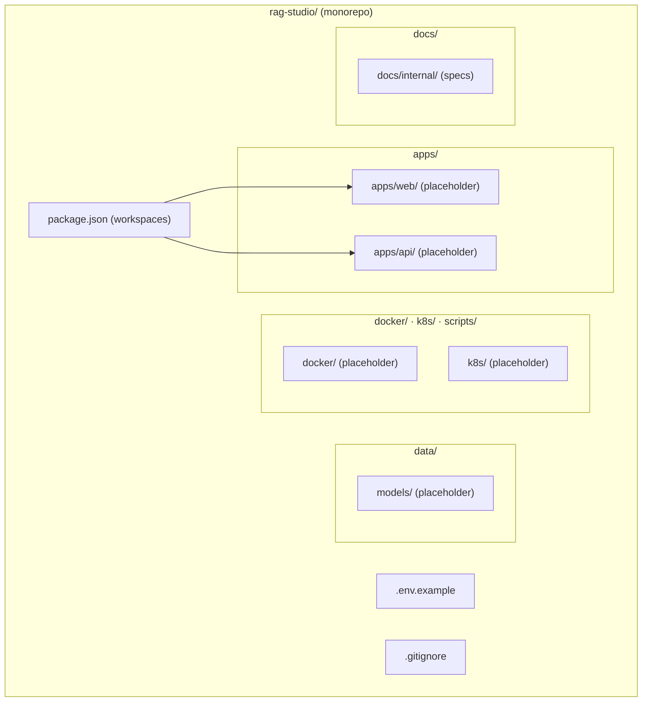

**Key decisions:**
- npm workspaces for dependency hoisting and cross-package scripts
- `data/` as neutral territory — neither frontend nor backend owns it
- `.env.example` as the single source of truth for required env vars

---

## Phase P0-2 · Docker Compose Development Environment

**What changed:** All infrastructure services are now defined and can run locally with a single `docker compose up -d`. The architecture grows from a file layout to a live service mesh.

### Design Level 2 — Local Service Topology

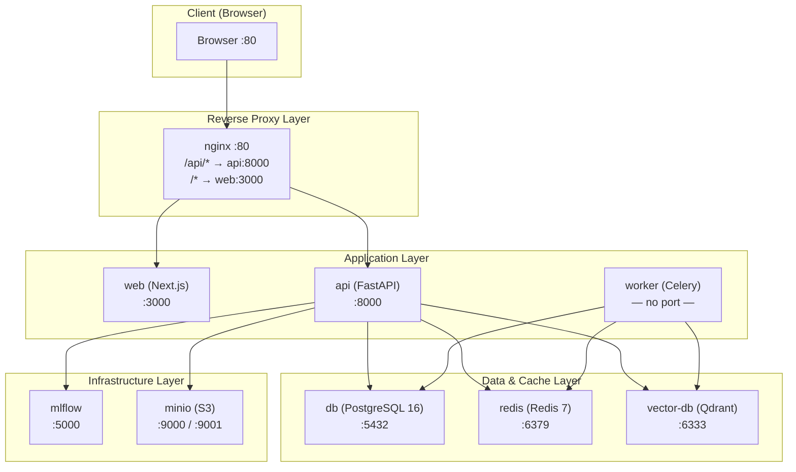

**Key decisions:**
- Nginx as single entry point — clients never speak directly to `web` or `api`
- All services health-checked so `depends_on: condition: service_healthy` works
- Dev override (bind mounts) vs prod override (pre-built images, resource limits) via compose file layering

---

## Phase P0-3 · CI/CD Pipelines

**What changed:** Code changes now flow through automated quality gates before reaching any environment. The "manual push to server" anti-pattern is replaced by a structured pipeline.

### Design Level 3 — CI/CD Flow

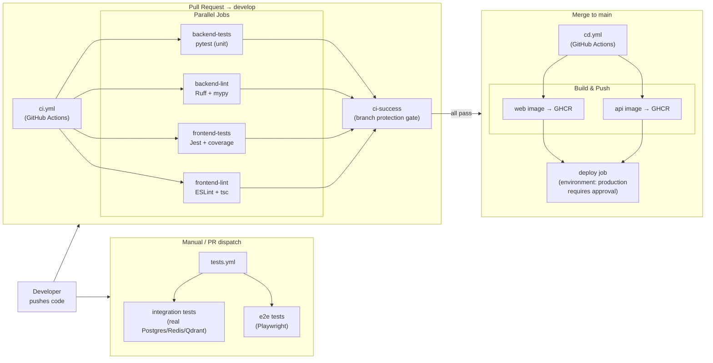

**Key decisions:**
- `ci-success` synthetic gate means branch protection needs only one check regardless of how many jobs are added
- CD triggers only on `main` — `develop` never auto-deploys
- Integration + E2E tests separated into `tests.yml` to keep CI fast

---

## Phase P0-4 · Backend Project Scaffold

**What changed:** The `apps/api/` placeholder is now a real FastAPI application with configuration, dependency injection, a health endpoint, and a production-grade Dockerfile.

### Design Level 4 — Backend Internal Architecture

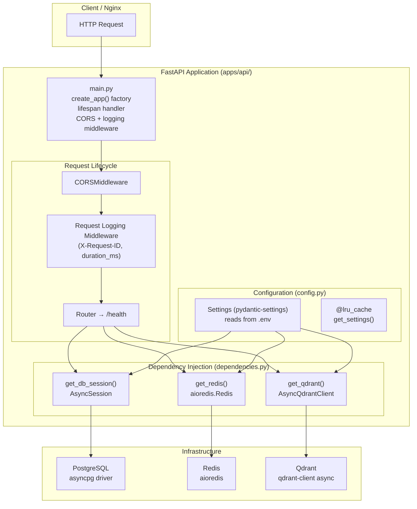

**Key decisions:**
- `create_app()` factory (not module-level instance) enables isolated test clients
- `@lru_cache` on `get_settings()` means `.env` is parsed exactly once per process
- Type aliases (`DbSession = Annotated[AsyncSession, Depends(...)]`) keep route signatures clean
- 3-stage Dockerfile: builder (C tools) → development (hot-reload) → runtime (non-root, minimal)

---

## Phase P0-5 · Frontend Project Scaffold

**What changed:** The `apps/web/` placeholder is now a real Next.js 14 App Router application with TypeScript, Tailwind CSS, shadcn/ui configuration, Zustand state management setup, a typed API client, and a production-grade Dockerfile. The frontend can now serve a landing page and is ready for feature development.

### Design Level 5 — Frontend Internal Architecture

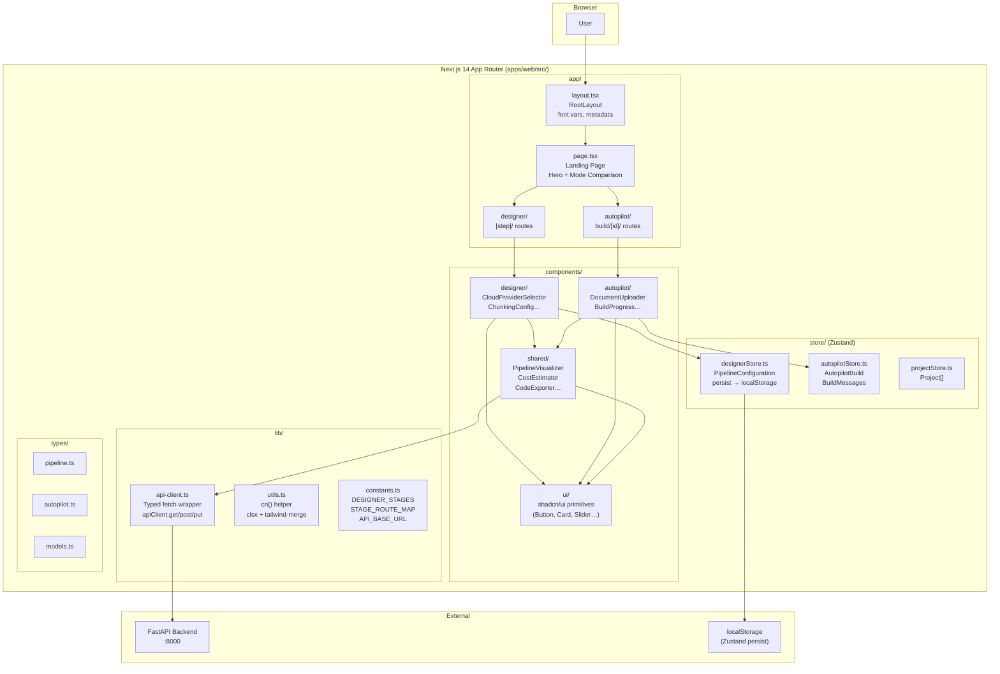

### Design Level 5b — Full Stack Integration View (P0-1 through P0-5)

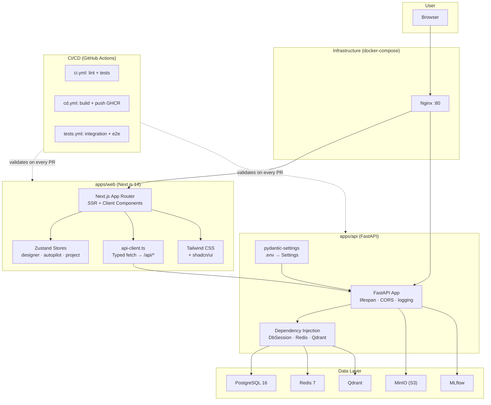

**Key decisions:**
- `output: 'standalone'` in `next.config.js` reduces the production Docker image from ~400MB to ~120MB
- Zustand `persist` middleware serialises `PipelineConfiguration` to `localStorage` — users never lose in-progress pipeline designs on page refresh
- `api-client.ts` typed wrapper normalises errors into `ApiError` instances — all callers handle one error type
- CSS custom properties (`--primary`, `--background`) in `globals.css` enable runtime theme switching without rebuilding Tailwind
- `components.json` with `cssVariables: true` ensures shadcn/ui components inherit the same CSS tokens

---

---

## Phase P1-1 · JSON Model Catalogs

**What changed:** The `data/` directory is now the shared source of truth for all model metadata, strategies, pricing, and templates. Both frontend and backend read from these files — eliminating duplication and establishing a shared data contract.

### Design Level 6 — Shared Data Layer

```mermaid
graph TB
    subgraph DATA["data/ (Shared Catalog Layer)"]
        subgraph MODELS["data/models/"]
            EMB["embeddings.json\n10 models (OpenAI, Cohere,\nHuggingFace, Nomic)\ndimensions, cost, quality, tier"]
            GEN["generation.json\n9 LLMs (GPT-4o, Claude,\nGemini, Llama, Mistral)\ncontextWindow, costInput, costOutput"]
            RNK["rerankers.json\n4 models (Cohere, BGE,\nMS-MARCO, FlashRank)\ncost, quality, latency"]
        end

        subgraph STRATEGIES["data/"]
            CHK["chunking-strategies.json\n7 strategies\nbestFor, pros, cons, defaultConfig"]
            VEC["vector-stores.json\n9 stores (Qdrant, Pinecone,\nWeaviate, FAISS, pgvector...)\ntype, features, pricing"]
            RET["retrieval-strategies.json\n6 strategies (similarity, MMR,\nhybrid, parent-child, multi-query, ensemble)\nparameters, complexity"]
            CLD["cloud-providers.json\n4 providers (AWS, GCP,\nAzure, Multi-cloud)\nnativeServices, ragStudioDefaults"]
        end

        subgraph CATALOG["data/"]
            TPL["templates.json\n6 templates\nfull PipelineConfiguration per template"]
            PRC["pricing.json\nper-model costs\ncost calculator formulas\nbenchmark reference points"]
        end
    end

    subgraph FRONTEND["apps/web (Next.js)"]
        SEL["EmbeddingSelector\nVectorStoreSelector\nChunkingConfig\nCloudProviderSelector"]
        COST_FE["CostEstimator\n(reads pricing.json)"]
        TPL_FE["Template Gallery\n(reads templates.json)"]
    end

    subgraph BACKEND["apps/api (FastAPI)"]
        SCHEMA["Pydantic Schemas\n(validates model IDs against catalogs)"]
        COST_BE["cost_calculator.py\n(reads pricing.json)"]
        TPL_BE["TemplateService\n(reads templates.json)"]
    end

    EMB & GEN & RNK --> SEL
    PRC --> COST_FE & COST_BE
    TPL --> TPL_FE & TPL_BE
    CHK & VEC & RET & CLD --> SEL
    EMB & GEN --> SCHEMA
```

**Key decisions:**
- JSON files in `data/` serve as a **shared contract** — model IDs used in `PipelineConfiguration` are validated against these files on both frontend (TypeScript) and backend (Pydantic)
- `pricing.json` contains both raw prices AND documented formulas — cost calculator logic is traceable without reading code
- Templates store complete `PipelineConfiguration` objects — enabling atomic `POST /api/templates/{id}/apply` with no server-side merging
- `cloudProvider.ragStudioDefaults` cascades to downstream stages — selecting AWS pre-suggests OpenSearch, S3, and ECS Terraform templates
- Open-source models have `costPer1MTokens: 0.0` — the UI shows "free" but notes that self-hosting infrastructure costs apply

### Design Level 6b — Data Flow: JSON Catalog → UI → API

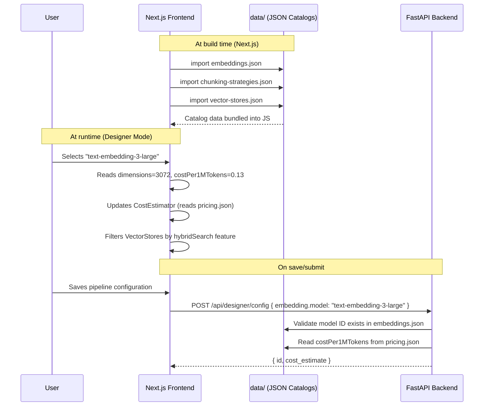

---

## Phase P1-2 · TypeScript Shared Types

**What changed:** The `apps/web/src/types/` directory now holds the complete TypeScript type system for the frontend. Every shape — from `PipelineConfiguration` to `AutopilotBuild` — is declared once, exported from a barrel, and shared across components, stores, and the API client. The JSON catalogs from P1-1 now have matching TypeScript interfaces, enabling type-safe imports of catalog data.

### Design Level 7 — TypeScript Type Layer

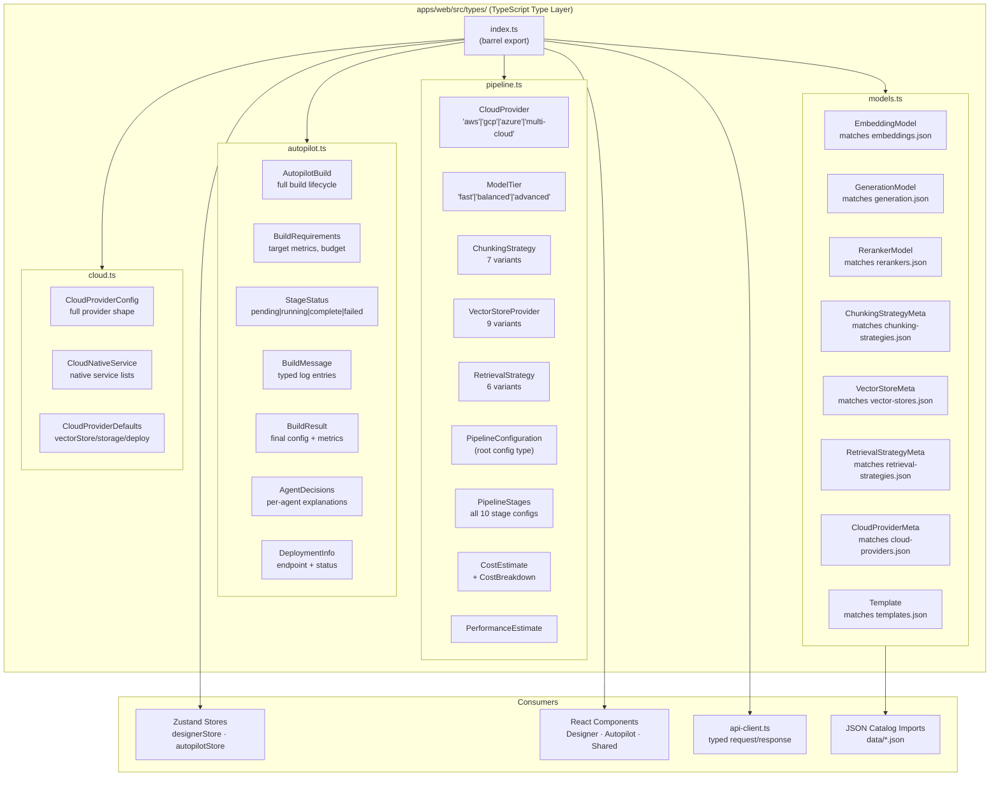

### Design Level 7b — Type Dependency Graph

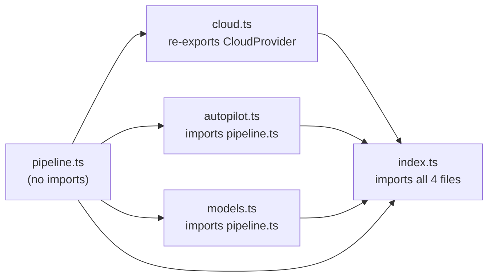

**Key decisions:**
- `pipeline.ts` has zero imports — it is the leaf of the dependency graph; all other type files depend on it, never the reverse
- `CloudProvider` defined once in `pipeline.ts`; `cloud.ts` re-exports it for cloud-module consumers; `index.ts` exposes it only from `pipeline.ts` to prevent duplicate-export errors
- Object shapes use `interface` (better error messages, supports `extends`); union enumerations use `type` (required for string-literal unions)
- Optional stage fields (`reranking?`, `routing?`, `memory?`, `evaluation?`) model business rules directly — stages that must always be present are required, opt-in features are optional
- `stages: Record<string, StageStatus>` in `AutopilotBuild` uses a dictionary (not array) for O(1) lookup by stage ID in UI rendering
- `AgentDecisions` typed structure enables the "Explain in Designer" feature — the Decision Explainer renders named fields rather than raw JSON

---

---

## Phase P1-3 · Python Pydantic Schemas

**What changed:** The `apps/api/app/schemas/` package now provides Pydantic v2 schemas for every API boundary. These are the Python mirror of the TypeScript types (P1-2) and use the same enum values as the JSON catalogs (P1-1). The shared contract is now complete on both sides.

### Design Level 8 — Python Schema Layer

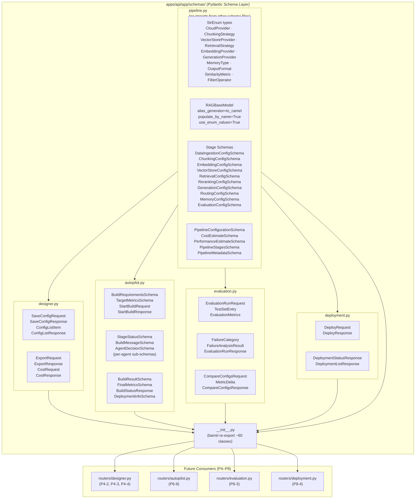

### Design Level 8b — Schema ↔ Catalog ↔ TypeScript Contract

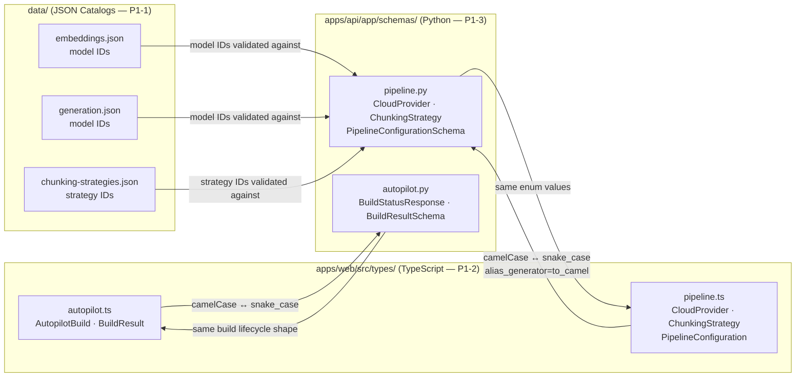

**Key decisions:**
- `RAGBaseModel` shared base with `alias_generator=to_camel` — one change propagates camelCase aliases to all ~60 schemas
- `StrEnum` for all enumerated values — members ARE strings, so they serialise and compare without `.value` calls
- `pipeline.py` has zero imports from other schema files — it is the leaf of the schema dependency graph, preventing circular imports
- `__init__.py` barrel with explicit `__all__` — single import point for all routers; refactoring a schema's file location only requires updating the barrel
- `from_attributes=True` deliberately omitted — will be added to `RAGBaseModel` in P1-4 when ORM models are introduced

---

## Design Progression Summary

| Phase | Layer Added | Key Artefact |
|-------|------------|-------------|
| P0-1 | Repository structure | `package.json` workspaces, `.gitignore`, `.env.example` |
| P0-2 | Live service mesh | `docker/docker-compose.yml` — 9 services wired |
| P0-3 | Quality gates | `.github/workflows/ci.yml`, `cd.yml`, `tests.yml` |
| P0-4 | Backend application | `apps/api/app/main.py`, `config.py`, `dependencies.py`, `Dockerfile` |
| P0-5 | Frontend application | `apps/web/src/` — Next.js 14 App Router, Zustand, API client, Tailwind, Dockerfile |
| P1-1 | Shared data layer | `data/` — 9 JSON catalogs covering models, strategies, pricing, and templates |
| P1-2 | TypeScript type system | `apps/web/src/types/` — 4 type files + barrel export; all catalog shapes typed |
| P1-3 | Python schema layer | `apps/api/app/schemas/` — 6 files, ~60 Pydantic v2 schemas; camelCase aliases; StrEnum types |
| P1-4 | Database + migrations | `apps/api/app/models/` — 5 ORM models; `alembic/` — initial migration, 5 tables, indexes, FK constraints |

---

## Phase P1-4 — Database Schema & Migrations

### Design Level 9 — ORM Model Layer

The database layer sits between the Pydantic schema layer and the service/route layer. It introduces 5 SQLAlchemy 2.0 ORM models with typed `Mapped[T]` annotations, JSONB columns for nested structures, and Alembic migrations for async PostgreSQL.

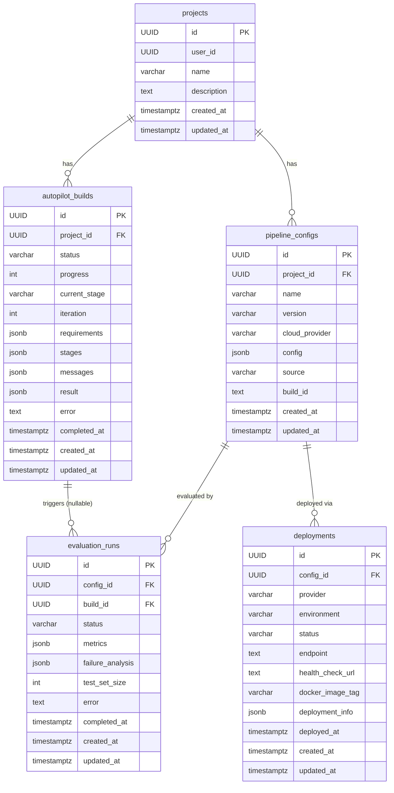

---

### Design Level 9b — ORM to Schema Data Flow

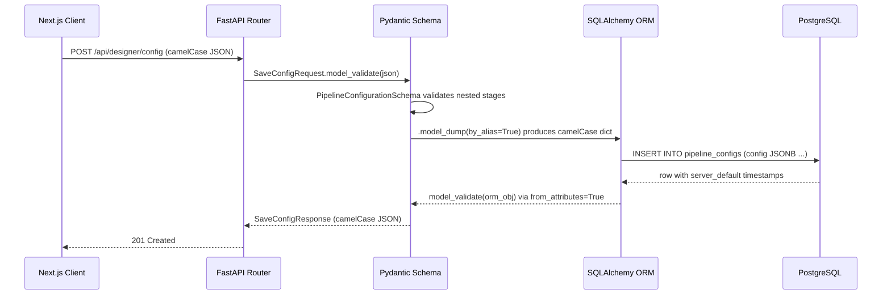

---

### Design Level 9c — Alembic Migration Architecture

```mermaid
graph TB
    subgraph "Migration Tooling"
        INI[alembic.ini]
        ENV[alembic/env.py - asyncio.run + create_async_engine]
        MAKO[alembic/script.py.mako]
        V001[alembic/versions/001_initial_schema.py]
    end

    subgraph "Python App Layer"
        SETTINGS[app/config.py - get_settings DATABASE_URL]
        BASE[app/models/base.py - Base + TimestampMixin]
        INIT[app/models/__init__.py - registers all metadata]
    end

    subgraph "PostgreSQL"
        PG[(ragstudio DB)]
        AM[alembic_version table]
    end

    INI --> ENV
    ENV --> SETTINGS
    ENV --> INIT
    INIT --> BASE
    ENV --> V001
    V001 --> PG
    PG --> AM
    SCRIPTS[scripts/migrate.sh] --> ENV
```
